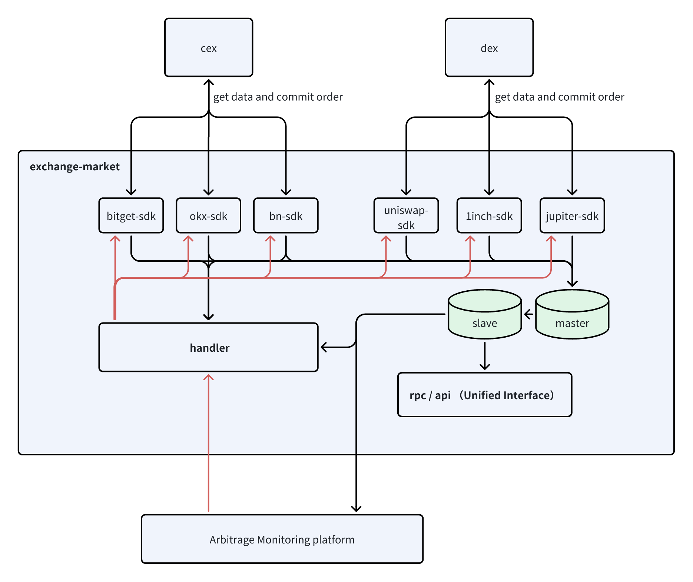

<!--
parent:
  order: false
-->

<div align="center">
  <h1> exchange-market repo </h1>
</div>

**Tips**: need [Go 1.22+](https://golang.org/dl/)

Unified market data interface for both CEX (e.g., Binance, OKX) and DEX (e.g., Uniswap).





## Contribute

### 1.fork repo

fork exchange-market to your github

### 2.clone repo

```bash
git@github.com:339-Labs/exchange-market.git
```

### 3. create new branch and commit code

```bash
git branch -C xxx
git checkout xxx

coding

git add .
git commit -m "xxx"
git push origin xxx
```


